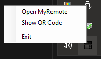
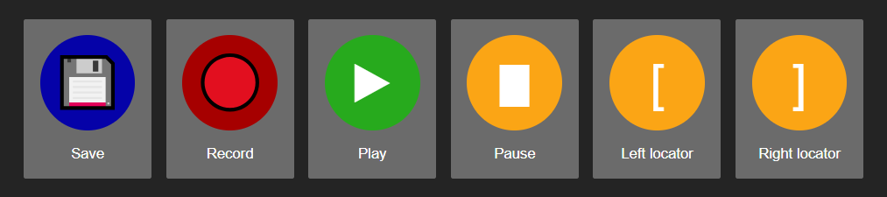
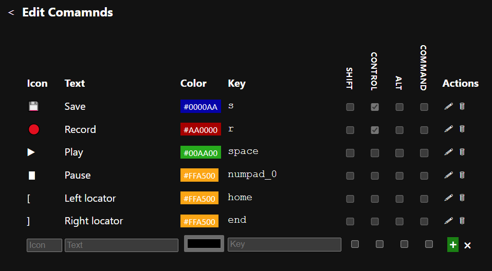
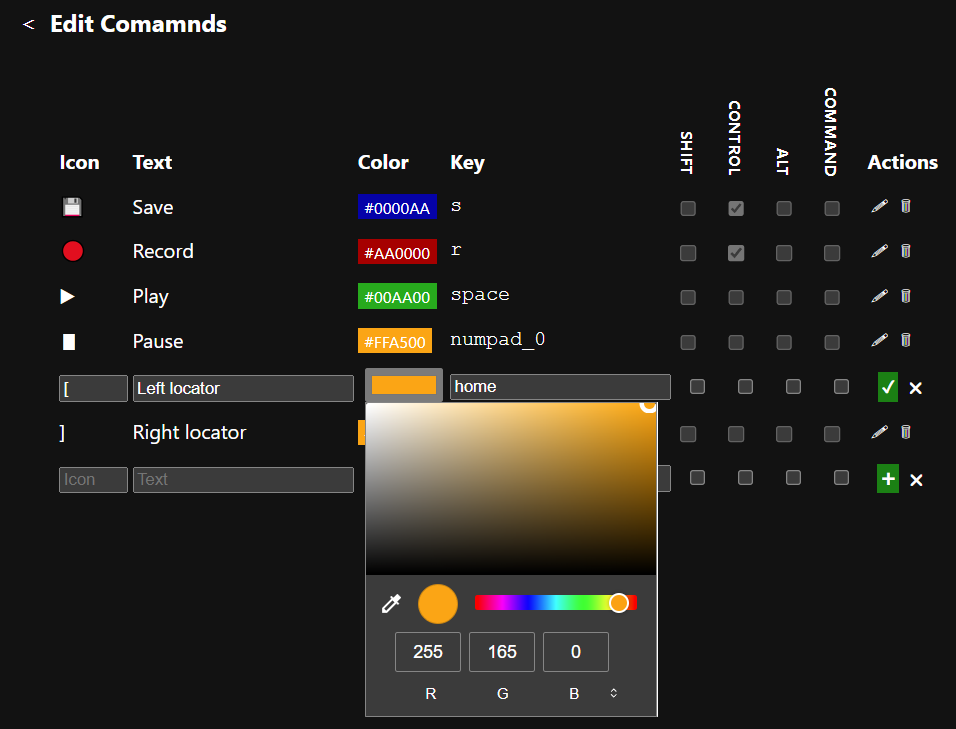

# node-myremote

Remote control Windows applications from a mobile device/web page.

## Synopsis

    npm i                             # bun dislikes some deps
    bun run build
    node src/taskbar-server.mjs

System tray:

Main interface:

Editor:

Editing:

## Description

Creates a Windows' system tray icon that can provide a URL for a webpage that 
can send key commands to Cubase, or any other Windows application.

Key commands can be added and edited, are preserved between page loads, 
and can also be saved to and loaded from file.

To re-arrange commands, drag the table rows.

This would work for any program, by updating a regexp.

    Sytem tray HTTP server -> HTTP document
    HTTP document -> System Tray WS server 
    System Tray WS server -> Key combination -> Target App

## Resources

* https://www.utf8icons.com
* https://robotjs.io/docs/syntax